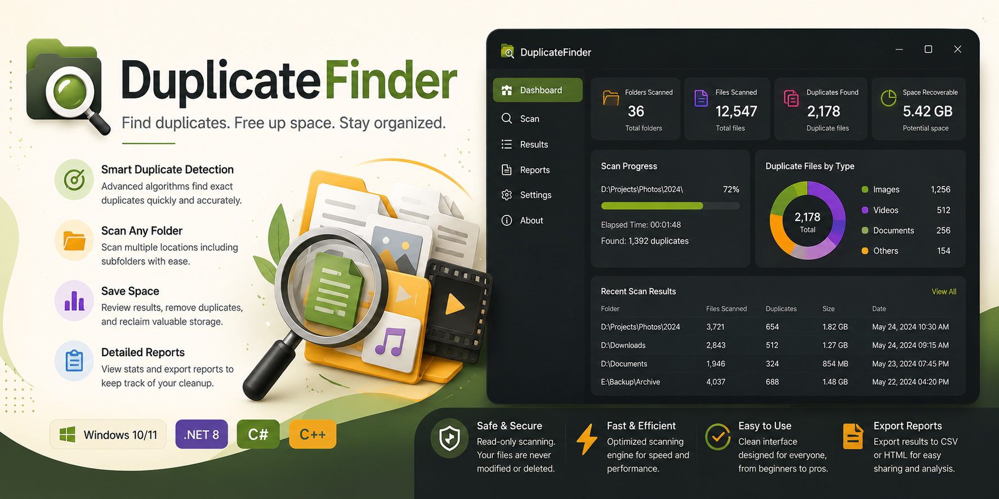
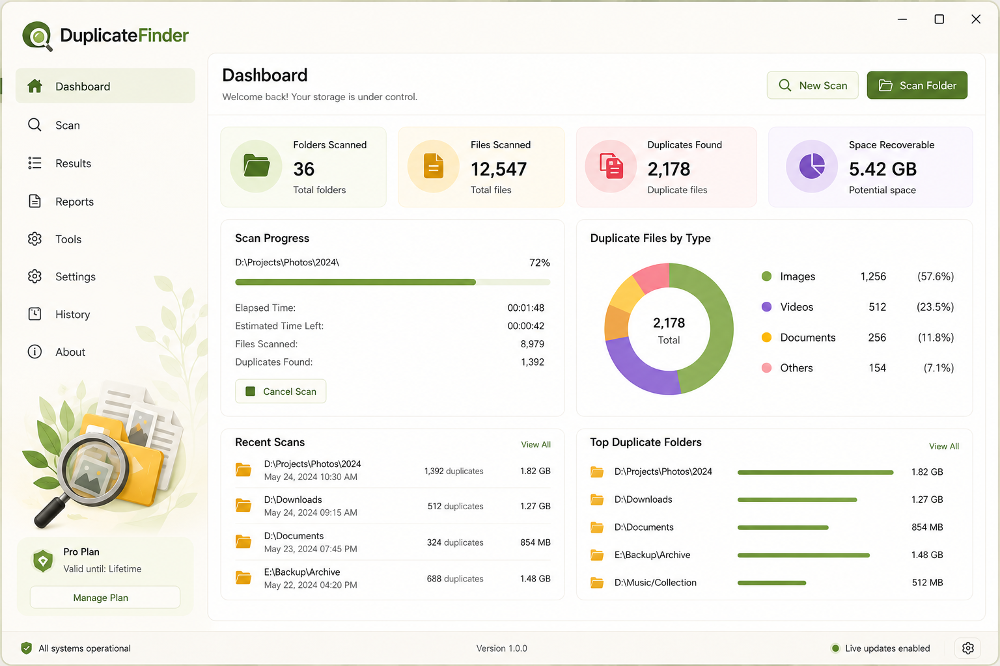
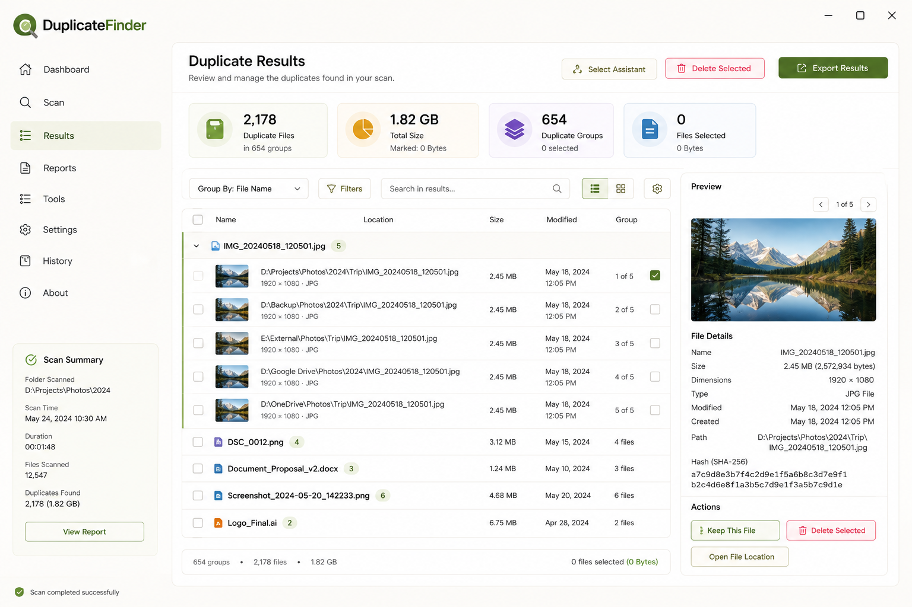

# DuplicateFinder
Smart duplicate file finder for Windows. Scan folders, identify duplicate files, compare file details, and reclaim storage space with an intuitive desktop interface

# DuplicateFinder

<p align="center">
  
</p>

<h1 align="center">DuplicateFinder</h1>

<p align="center">
  Find duplicate files, recover storage space, and keep your folders organized.
</p>

<p align="center">
  
  
  
  
  
</p>

---

## Why DuplicateFinder?

Over time, duplicate files accumulate across Downloads, Documents, Desktop folders, external drives, and backups.

DuplicateFinder helps identify repeated files and provides a simple way to review duplicate groups before taking action.

### Benefits

✔ Recover valuable disk space

✔ Reduce folder clutter

✔ Review duplicate files safely

✔ Analyze large directories

✔ Export scan reports

✔ Improve file organization

---

## Features

### Smart Scanning

* Fast folder analysis
* Multi-folder scanning
* Recursive directory support
* Large file handling

### Duplicate Detection

* File hash comparison
* File size matching
* Duplicate grouping
* Detailed scan results

### Review Tools

* Duplicate preview
* File location overview
* Scan summaries
* Exportable reports

### Storage Insights

* Folder statistics
* Space usage overview
* Duplicate file counts
* Scan history

---

## Screenshots

### Dashboard



### Duplicate Results



---

## How It Works

1. Select one or more folders.
2. Start a scan.
3. Review duplicate groups.
4. Export results.
5. Organize your files.

---

## Use Cases

### Home Users

* Clean Downloads folder
* Remove repeated images
* Review old backups

### Content Creators

* Organize media libraries
* Find duplicate assets
* Manage project folders

### Power Users

* Analyze large drives
* Review archive collections
* Optimize storage usage

---

## Project Structure

```text
src/
├── cpp/
│   ├── DuplicateScanner.cpp
│   ├── DuplicateScanner.h
│   └── FileHasher.cpp
│
└── csharp/
    ├── ScanProfile.cs
    ├── ResultsManager.cs
    └── ReportGenerator.cs
```

---

## Roadmap

### Version 1.1

* Folder Exclusions
* Duplicate Image Preview
* Faster Scan Engine

### Version 1.2

* Scheduled Scans
* Advanced Filters
* Improved Reports

### Version 2.0

* Multi-Drive Analysis
* Cloud Folder Support
* Smart Cleanup Suggestions

---

## Download

Latest release:

```text
DuplicateFinder-v1.0.0.zip
```

Executable:

```text
DuplicateFinder.exe
```

---

## License

Released under the MIT License.
